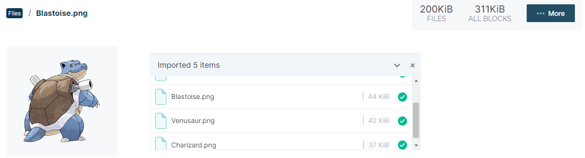
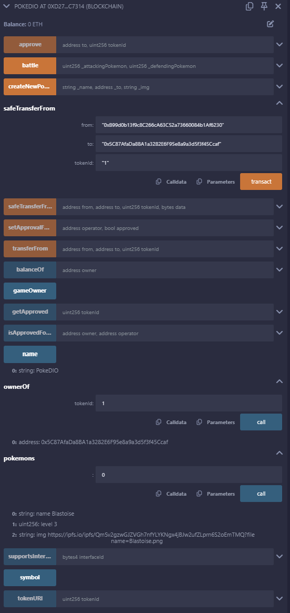

# Criando o seu NFT de Pokémon com Blockchain

Utilizando a IDE Remix, é implementado o [PokeDIO.sol](./PokeDIO.sol)

Após o sucesso na compilação deve-se realizar o deploy, com a carteira do Metamask devidamente conectada.

Utilizando o IPFS, é possível gravar as imagens dos pokemons na estrutura da blockchain.

Interagindo com o contrato, a partir da própria estrutura do IDE do Remix é possivel interagir com o contrato após o deploy.

